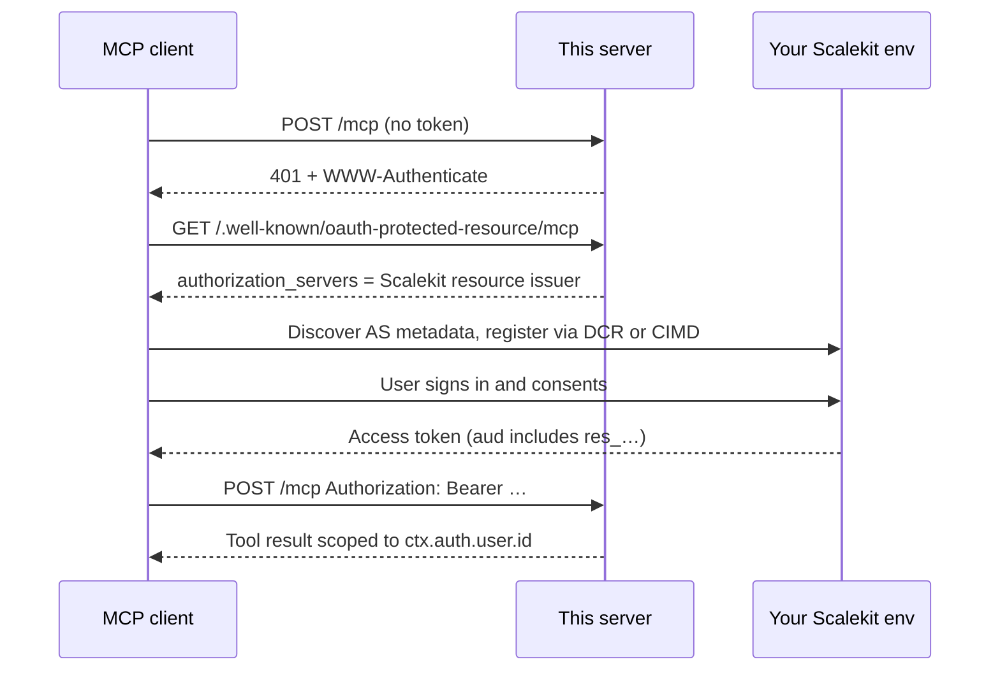

<p align="left">
  <a href="https://scalekit.com" target="_blank" rel="noopener noreferrer">
    
  </a>
</p>

# mcp-use + Scalekit MCP Auth

An [mcp-use](https://mcp-use.com) MCP server that authenticates with [Scalekit](https://scalekit.com) OAuth 2.1.

Teammates share one server URL. Each person signs in. Tools see *their* identity (`ctx.auth.user.id`), not a shared API key.

This example does **not** use `@scalekit-sdk/node` and does **not** need a Scalekit client id or secret. The resource server verifies JWTs against Scalekit JWKS.

The cookbook-style how-to lives in [`docs/v2/typescript/server/authentication/providers/scalekit.mdx`](docs/v2/typescript/server/authentication/providers/scalekit.mdx). This README is the runbook for *this* repository.

> [!IMPORTANT]
> Use **your own** Scalekit environment. This repository ships placeholders only. Never commit `.env`.

## What you get

- Streamable HTTP MCP at `/mcp`
- 401 + `WWW-Authenticate` pointing at RFC 9728 protected-resource metadata
- Scalekit as the authorization server (DCR and CIMD)
- `whoami` — authenticated user, scopes, and token `iss` / `aud`
- `greet` — a tool that keys off `ctx.auth.user.id`

## How a client signs in



## Prerequisites

- Node.js 22.22.2 or newer
- A [Scalekit](https://app.scalekit.com) account ([sign up](https://scalekit.com) if you do not have one)
- At least one [auth method](https://docs.scalekit.com/mcp/auth-methods/social/) enabled (Google, GitHub, passwordless, or [enterprise SSO](https://docs.scalekit.com/mcp/auth-methods/enterprise/))

## 1. Register an MCP server in Scalekit

Follow the [MCP Auth quickstart](https://docs.scalekit.com/authenticate/mcp/quickstart/) with these values:

1. Open [Scalekit Dashboard](https://app.scalekit.com) → **MCP servers** → **Add MCP server**.
2. Give it a name. That name appears on the consent screen.
3. Enable **dynamic client registration** and **Client ID Metadata Document (CIMD)**. Public clients such as Inspector, Claude, and Cursor need at least one of these; keep both on.
4. Under advanced settings, set **Server URL** to:

   ```text
   http://localhost:3000/mcp
   ```

   No trailing slash. When set, Scalekit writes this URL into the access-token `aud` claim alongside the `res_…` id. If you leave it empty, `aud` is only `res_…` — this example still verifies.
5. Save. Copy from the server page:
   - **Environment URL** — `https://<your-env>.scalekit.cloud`
   - **Resource ID** — `res_…`

> [!CAUTION]
> If you toggle DCR or CIMD later, reconnect the MCP client. Inspector and other clients cache authorization-server metadata. This process does not.

## 2. Configure this repo

```bash
git clone git@github.com:scalekit-developers/scalekit-mcpuse-example.git
cd scalekit-mcpuse-example
npm install
cp .env.example .env
```

Edit `.env` with **your** values. There are no sample credentials in this repo.

```env
SCALEKIT_ENVIRONMENT_URL=https://your-env.scalekit.cloud
SCALEKIT_RESOURCE_ID=res_xxxxxxxx
MCP_URL=http://localhost:3000/mcp
```

| Variable | Where it comes from |
| --- | --- |
| `SCALEKIT_ENVIRONMENT_URL` | Dashboard → API credentials → Environment URL |
| `SCALEKIT_RESOURCE_ID` | Dashboard → MCP servers → this server → `res_…` |
| `MCP_URL` | Must match **Server URL** exactly (no trailing slash) |

There is no `SCALEKIT_CLIENT_ID` or `SCALEKIT_CLIENT_SECRET`. The resource server only verifies tokens that Scalekit already issued.

## 3. Run and sign in

```bash
npm run dev
```

| | |
| --- | --- |
| MCP endpoint | http://localhost:3000/mcp |
| Inspector | http://localhost:3000/mcp/inspector |

1. Open Inspector.
2. Connect to `http://localhost:3000/mcp`. The first call returns **401**; Inspector starts Scalekit login.
3. Complete consent in the browser.
4. Call **`whoami`**.

You should see a `usr_…` id, `subjectType: "user"`, scopes such as `openid` / `profile`, and:

```json
{
  "iss": "https://your-env.scalekit.cloud",
  "aud": ["http://localhost:3000/mcp", "res_xxxxxxxx"]
}
```

`iss` may also be `https://your-env.scalekit.cloud/resources/res_xxxxxxxx`. This example accepts both while Scalekit migrates issuer values.

Then call **`greet`**. The greeting uses `ctx.auth.user.id` from the verified token — that is the pattern for scoping tool data per user.

## How verification works

```ts
oauth: oauthScalekitProvider({
  environmentUrl: process.env.SCALEKIT_ENVIRONMENT_URL!,
  resourceId: process.env.SCALEKIT_RESOURCE_ID!,
  resource: process.env.MCP_URL!,
}),
```

`resourceId` is the JWT `aud` (`res_…`). `resource` is the public MCP URL. mcp-use puts `resource` in RFC 9728 protected-resource metadata. It is not a second audience check.

| Check | Source |
| --- | --- |
| Signature | JWKS at `{environmentUrl}/keys` (from live AS metadata — not a guessed path) |
| `iss` | Environment root **or** `{environmentUrl}/resources/{resourceId}` |
| `aud` | Must include `resourceId` (`res_…`) |
| Identity | `ctx.auth.user.id` is the token `sub` |

`resourceId` is the per-server security boundary. A token minted for a different MCP server in the same Scalekit environment must fail.

Authorization belongs next to the tool:

```ts
async (_args, ctx) => {
  // ctx.auth.user.id is this caller — scope your data to it
  if (!ctx.auth.scopes.includes("todos:write")) {
    return { isError: true, content: [{ type: "text", text: "Missing scope" }] };
  }
};
```

`oauth/scalekit.ts` is a prototype of a first-class `mcp-use/oauth/scalekit` adapter. It is not published on npm yet.

## Project structure

| Path | Role |
| --- | --- |
| `index.ts` | mcp-use server, OAuth wiring, `whoami` and `greet` |
| `oauth/scalekit.ts` | JWT + JWKS provider |
| `docs/v2/.../scalekit.mdx` | Cookbook: authenticate an mcp-use server with Scalekit |
| `.env.example` | Placeholders only |

## Changing the public URL

If you expose the server (tunnel, deploy, custom host):

1. Set **Server URL** in Scalekit to that origin + `/mcp` (no trailing slash).
2. Set `MCP_URL` to the same string.
3. Restart this process.

The verifier does not change. `resourceId` stays the audience check.

## Troubleshooting

| Symptom | Likely cause |
| --- | --- |
| Server throws on boot about `SCALEKIT_*` or `MCP_URL` | `.env` is missing or a value is empty |
| Inspector never starts login | DCR and CIMD both off — enable at least one and save. If they are already on, reconnect Inspector to drop cached metadata |
| Login works, every tool is 401 | **Server URL** does not match `MCP_URL` (trailing slash, wrong port, `http` vs `https`) |
| `whoami` `aud` has only `res_…` | Server URL was left empty in the dashboard — still valid; this example binds on `resourceId` |
| Need claim details on a 401 | Set `MCP_USE_OAUTH_DEBUG=1` and retry. Logs print `iss`, `aud`, `sub` — never the raw token |

Scalekit also publishes a [MCP auth troubleshooting](https://docs.scalekit.com/authenticate/mcp/troubleshooting/) guide.

## Security

- Do not put client secrets, API keys, or personal environment URLs in this repository.
- `.env` is gitignored. Commit only `.env.example`.
- This process never calls Scalekit with a client secret. It only verifies bearer tokens.
- `MCP_USE_OAUTH_DEBUG=1` decodes the JWT payload for `iss` / `aud` / `sub`. It does not print the token.

## Docs

- [Authenticate an mcp-use server with Scalekit](docs/v2/typescript/server/authentication/providers/scalekit.mdx)
- [Scalekit MCP Auth quickstart](https://docs.scalekit.com/authenticate/mcp/quickstart/)
- [Scalekit MCP overview](https://docs.scalekit.com/authenticate/mcp/overview/)
- [mcp-use](https://docs.mcp-use.com)
- [MCP authorization spec](https://modelcontextprotocol.io/specification/latest/basic/authorization)
